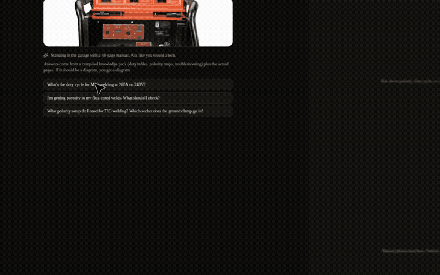

# Prox Founding Engineer Challenge

Multimodal shop tech for the **Vulcan OmniPro 220** (Harbor Freight 57812).

Not a RAG chatbot. A compiled knowledge pack (duty tables, polarity maps, troubleshooting, captioned manual pages) plus the [Claude Agent SDK](https://code.claude.com/docs/en/agent-sdk) driving tools that **draw** sockets, duty-cycle clocks, and checklists, and **surface the actual page** from the book.

## Demo video

The demo lives in this folder: **`docs/`**

| File | What it is |
|---|---|
| [`docs/omnipro-demo.gif`](docs/omnipro-demo.gif) | Inline preview (this is what GitHub shows below) |
| [`docs/omnipro-demo.mp4`](docs/omnipro-demo.mp4) | Full 30s recording — click the GIF or this link |

It walks the three evaluation questions: MIG duty cycle (**25%** at 200 A / 240 V), TIG ground clamp in the **positive** socket, and flux-cored porosity with a checklist plus manual pages.

[](docs/omnipro-demo.mp4)


The original Prox briefing (what they asked us to build) is in [`CHALLENGE.md`](CHALLENGE.md). This README is the solution.

## Run locally (≈2 minutes)

```bash
git clone https://github.com/MekalaKaveri18/prox-challenge
cd prox-challenge
cp .env.example .env.local
# paste your Anthropic key: ANTHROPIC_API_KEY=sk-ant-…
npm install
npm run dev
```

Open [http://127.0.0.1:43181](http://127.0.0.1:43181).

Without a key the UI still runs the **compiled pack** on the three evaluation questions so you can see diagrams and manual pages. With a key, turns go through the Claude Agent SDK (`query()` + in-process MCP tools). That is the submission path Prox will use.

## What we were tested on

| Question | Grounded answer |
|---|---|
| Duty cycle, MIG 200 A on 240 V | **25%** — 2.5 min weld / 7.5 min rest in a 10 min window. Manual p.7, p.19, nameplate. |
| Porosity on flux-cored | Ordered checks: **DCEN polarity first**, then dirty metal, dirty wire, no gas on self-shielded, CTWD &lt; ½", steady travel. Manual p.37 + p.43 + diagnosis photos. |
| TIG polarity / ground socket | **DCEN**. Ground clamp → **POSITIVE (+)**. Torch → **NEGATIVE (−)**. 100% argon 10–25 SCFH. Manual p.24. |

## Architecture

```
files/*.pdf  →  (compile)  →  knowledge pack + /public/manual/*.jpg
                                      ↓
                         Claude Agent SDK  query()
                         MCP server "omni" (same process)
                           lookup_spec
                           get_duty_cycle   → artifact + figure
                           get_polarity     → artifact + figure
                           get_figure
                           render_artifact  (Claude-artifacts iframe)
                                      ↓
                         Next.js UI  chat | workbench
```

### Why not vector RAG over the PDF

The facts that fail interviews live in **tables and drawings**: dinse sockets, duty-cycle nameplate, weld-diagnosis photos, the door sticker. An embedding over OCR will miss a socket or invent 30% duty cycle. The pack stores those as data. The model **looks them up**. Diagrams are rendered from that data, not freehanded SVG.

### Knowledge pack

`src/lib/knowledge/pack.ts` is the engine:

- Rated duty points from p.7 / p.19 / p.29 / the data plate (including 60% nameplate rows)
- Polarity + exact sockets per process
- Troubleshooting trees (porosity, unstable arc, bird’s nest)
- Figure index: captioned JPEGs of the real pages (`public/manual/`)

Interpolation between published duty points is labeled as interpolation. Exact nameplate cells are labeled as rated.

### Agent SDK

`src/lib/agent/run.ts` uses `query()` from `@anthropic-ai/claude-agent-sdk` with `createSdkMcpServer` / `tool()`. Built-in Bash/Edit/Web tools are disallowed. `settingSources: []` and `strictMcpConfig: true` so the agent only sees this product’s tools.

### Multimodal output

Workbench on the right (stacked on mobile):

1. **Artifact iframe** — sandboxed HTML, same idea as Claude artifacts: polarity board, duty-cycle clock, porosity checklist, settings configurator.
2. **Manual page** — the actual figure from the owner’s manual, quick-start, or selection chart.

Voice is browser push-to-talk (Web Speech) plus speak-back. Photo attach is for weld diagnosis against the p.35–37 charts.

### Tone

Garage lead, not Zendesk. Next action, socket names, then the picture.

## Design decisions worth arguing about

- **Codegen as primitive, data as source of truth.** The model chooses *which* artifact; the renderer fills sockets from the pack. Wrong-polarity hallucinations cannot draw a lying diagram.
- **Selection chart is an image, not a hallucinated WFS table.** The door sticker OCR is unreliable in the PDF. We show the chart and the synergic LCD procedure (white mark) instead of inventing 18.5 V / 312 IPM.
- **Offline pack is a preview, not the interview.** Prox plugs in a key; the SDK path is the real agent. The pack is what the agent is *allowed* to know.
- **No Twilio.** Expressive voice at Hertz-level is the job. This take-home proves the knowledge + visual loop first; the mic is a browser extra.

## Layout

```
files/                  original manuals (owner, quick start, selection chart)
public/manual/          rasterized pages used as figures
public/product/         product photos from the starter repo
src/lib/knowledge/      pack + search + duty lookup
src/lib/artifacts/      HTML artifact templates
src/lib/agent/          SDK runner, MCP tools, system prompt, offline preview
src/app/api/chat/       SSE stream
src/components/shop/    garage UI
```

## Video

See the [Demo video](#demo-video) section at the top (`docs/omnipro-demo.gif` and `docs/omnipro-demo.mp4`).
